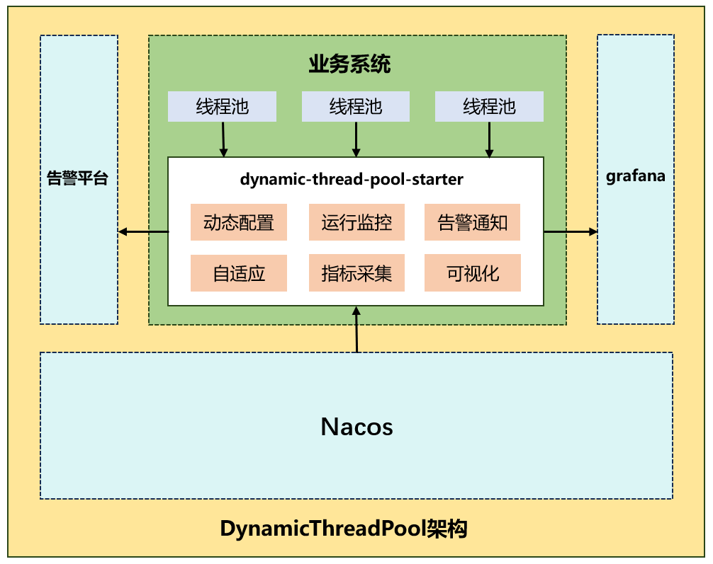

# 功能模块

- [x] 支持运行时动态调整线程池参数。
- [x] 支持基于Nacos的配置中心。
- [x] 集成prometheus埋点采集，grafana可视化展示。
- [x] 定时检测线程池资源使用，触发阈值启动报警通知。
- [x] 提供多种维度报警。例如：参数变更、队列阈值触发等。
- [x] 设计并实现线程池参数的自适应调整。

# 系统架构图


# 使用说明

## 1. 引入依赖

```xml
<!--动态线程池-->
<dependency>
    <groupId>com.iteng</groupId>
    <artifactId>dynamic-thread-pool-spring-boot-starter</artifactId>
    <version>1.0</version>
</dependency>
<!--Nacos注册中心-->
<dependency>
    <groupId>com.alibaba.cloud</groupId>
    <artifactId>spring-cloud-starter-alibaba-nacos-config</artifactId>
    <version>2021.0.4.0</version>
</dependency>
<!--prometheus监控-->
<dependency>
    <groupId>org.springframework.boot</groupId>
    <artifactId>spring-boot-starter-actuator</artifactId>
</dependency>
<dependency>
    <groupId>io.micrometer</groupId>
    <artifactId>micrometer-registry-prometheus</artifactId>
</dependency>
```

## 2. 配置yml

```yml
# 动态线程池配置
dynamic:
  thread:
    pool:
      config:
        # 注册中心 必填
        registry: nacos
        # 启用监控 选填
        monitor: true
        
# prometheus配置 选填
# monitor: true 必填
# prometheus：http://127.0.0.1:9090/
# grafana：http://127.0.0.1:3000/
management:
  endpoints:
    web:
      exposure:
        include: "*"
  endpoint:
    prometheus:
      enabled: true
    health:
      show-details: always
  metrics:
    export:
      prometheus:
        enabled: true
```

## 3. Nacos配置

DataId：`thread:pool:`applicaionName

Group：`dynamic_thread_pool`

~~~java
[{
    "threadPoolName": "threadPoolExecutor01", // 线程池对象Bean名称
    "corePoolSize": 8, // 核心线程数
    "maximumPoolSize": 8, // 最大线程数
    "queueCapacity": 500, // 可扩容队列容量
    "queueWarn": true, // 是否开启队列容量阈值告警
    "queueWarnThreshold": 80, // 队列容量阈值
    "queueAdapt": true, // 是否开启队列容量自适应扩容
    "queueAdaptThreshold": 50, // 队列容量自适应扩容阈值
    "queueAdaptMaxCapacity": 2000, // 队列自适应扩容容量峰值
    "threadAdapt": true, // 是否开启线程自适应扩容（只扩容最大线程数）
    "threadAdaptThreshold": 80, // 线程自适应扩容阈值
    "threadAdaptMaximumPoolSize": 16 // 线程自适应扩容峰值
},{
    "threadPoolName": "threadPoolExecutor02",
    "corePoolSize": 16,
    "maximumPoolSize": 32,
    "queueCapacity": 5000,
    "queueWarn": false,
    "queueWarnThreshold": 50,
    "queueAdapt": false,
    "queueAdaptThreshold": 80,
    "queueAdaptMaxCapacity": 5000,
    "threadAdapt": false,
    "threadAdaptThreshold": 80,
    "threadAdaptMaximumPoolSize": 16
}]
~~~


## 4. 使用

```java
// 创建线程池并加入到Spring容器
@Bean("threadPoolExecutor01")
public ThreadPoolExecutor threadPoolExecutor01() {
    return new ThreadPoolExecutor(32,
            100, 5000,
            TimeUnit.SECONDS,
            new VariableLinkedBlockingQueue<>(1000), // 自定义的阻塞队列，支持动态扩容
            r -> {
                Thread thread = new Thread(r);
                thread.setName("thread-pool-01-" + thread.getId());
                return thread;
            },
            new ThreadPoolExecutor.AbortPolicy());
}

// 模拟线程池执行任务
@Bean
public ApplicationRunner applicationRunner(ExecutorService threadPoolExecutor01) {
    return args -> {
        try {
            while (true) {
                // 创建一个随机时间生成器
                Random random = new Random();
                // 随机时间，用于模拟任务启动延迟
                int initialDelay = random.nextInt(10) + 1; // 1到10秒之间
                // 随机休眠时间，用于模拟任务执行时间
                int sleepTime = random.nextInt(10) + 1; // 1到10秒之间
                // 提交任务到线程池
                threadPoolExecutor01.submit(() -> {
                    try {
                        // 模拟任务启动延迟
                        TimeUnit.SECONDS.sleep(initialDelay);
                        // System.out.println("Task started after " + initialDelay + " seconds.");

                        // 模拟任务执行
                        TimeUnit.SECONDS.sleep(sleepTime);
                        // System.out.println("Task executed for " + sleepTime + " seconds.");
                    } catch (InterruptedException e) {
                        Thread.currentThread().interrupt();
                    }
                });
                Thread.sleep(random.nextInt(200) + 1);
            }
        } catch (RejectedExecutionException e) {
            System.err.println("系统出现异常：" + e.getMessage());
        }
    };
}
```
